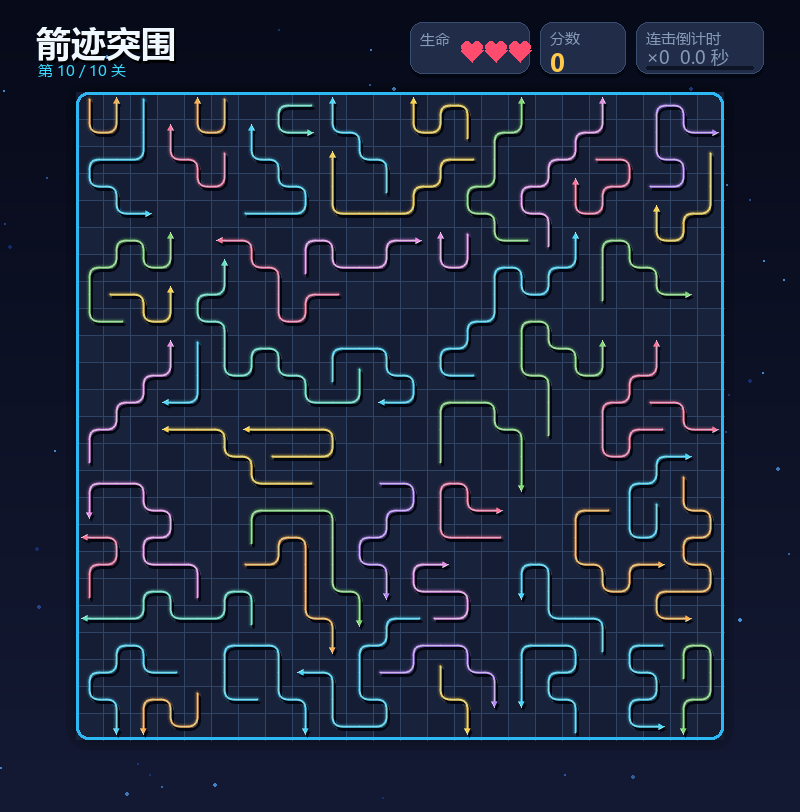

# 《箭迹突围》小游戏开发记录

| 项目 | 内容 |
| --- | --- |
| 这个作业属于哪个课程 | **待填写：课程名称与链接** |
| 这个作业要求在哪里 | **待填写：作业名称与链接** |
| 这个作业的目标 | 使用 Python 和 AIGC 完成一款箭头消除闯关小游戏 |
| 学号 | **待填写：学号** |
| GitHub 仓库 | [software-engineering-homework-2](https://github.com/boluoyellow/software-engineering-homework-2) |

## 1. 项目展示

游戏采用深色霓虹风格。玩家需要观察箭头的方向和互相阻挡的关系，按照合适的顺序将它们全部移出棋盘。



## 2. 项目介绍

### 游戏规则

- 点击前方没有阻挡的箭头，可以将它移出棋盘。
- 点击被挡住的箭头会失去生命，生命耗尽后需要重试本关。
- 连续正确消除会增加连击和分数。
- 清空当前棋盘后进入下一关，后面的地图会更大、箭头也会更多。

### 主要功能

- 共 10 个关卡，难度逐渐提高。
- 箭头有不同长度、方向和弯曲形状。
- 地图会随机生成，并在开始游戏前检查是否有解。
- 包含消除、碰撞、连击、失败和通关反馈。
- 游戏界面和提示均使用中文。

## 3. 实现思路

### 箭头表示

一支箭由起点、初始方向、每段长度和转弯顺序组成。程序按照这些信息依次计算箭身经过的格子，因此同一套结构既能表示直箭，也能表示多次转弯的箭头。

```python
def body_cells(self):
    cells = [(self.row, self.col)]
    row, col = self.row, self.col
    dx, dy = self.vector
    for segment_index, length in enumerate(self.segments):
        for _ in range(length):
            row, col = row + dy, col + dx
            cells.append((row, col))
        if segment_index < len(self.turns):
            dx, dy = _rotate((dx, dy), self.turns[segment_index])
    return tuple(cells)
```

### 阻挡判断

点击箭头时，程序从箭头尖端开始，沿箭头方向检查到棋盘边缘。如果途中还有其他箭身，就认为当前箭头被阻挡。

```python
def can_move(index, arrows, mask, grid_size):
    occupied = occupied_cells(arrows, mask)
    own_body = set(arrows[index].body_cells())
    return all(
        cell not in occupied or cell in own_body
        for cell in arrows[index].path_cells(grid_size)
    )
```

### 地图生成与可解性

地图生成时，每支箭会沿空闲格子随机生长。已经留作出口的格子不会再被后生成的箭头占用，从而避免互相形成无法解除的阻挡。地图生成完成后，还会再次调用求解器进行检查，确认可以清空后才进入游戏。

```python
path_blocked = occupied | reserved | set(ray)
cells = _grow_path(head, direction, target, path_blocked, grid_size, rng)

occupied.update(cells)
reserved.update(ray)
```

## 4. AIGC 使用过程

这次作业中，我主要使用 AIGC 帮助拆分需求、检查代码和寻找问题。开发时先描述想要的游戏效果，再根据运行结果和截图继续提出修改，例如调整弯箭头形状、碰撞动画、界面文字和地图密度。

AIGC 给出的内容并没有直接全部采用。地图生成算法前后改了几次：最开始虽然能保证有解，但排列得过于整齐；后来根据实际画面继续调整，最终改成允许空位的随机路径。每次修改后都重新运行游戏和测试，确认效果正常后才保留。

## 5. 测试结果

项目使用 `test_solver.py` 进行自动测试：

```bash
python test_solver.py
```

| 测试内容 | 预期结果 | 实际结果 |
| --- | --- | --- |
| 箭头路径与转弯 | 路径连续且不自交 | 通过 |
| 阻挡判断 | 有障碍时不能消除 | 通过 |
| 随机地图 | 箭头之间不重叠 | 通过 |
| 关卡求解 | 每张地图都可以清空 | 通过 |
| 动画路径 | 箭头能沿自身路径移动 | 通过 |

另外生成了 200 张不同的随机地图进行检查，没有发现重叠或无法通关的情况。

## 6. PSP 表格

> 下表中的工时需要按照自己的实际投入补充。

| 任务 | 预估耗时（小时） | 实际耗时（小时） | 差异（小时） |
| --- | ---: | ---: | ---: |
| 需求分析与游戏设计 | 待填写 | 待填写 | 待填写 |
| Python 与图形库学习 | 待填写 | 待填写 | 待填写 |
| 游戏界面实现 | 待填写 | 待填写 | 待填写 |
| 路径与碰撞逻辑实现 | 待填写 | 待填写 | 待填写 |
| 关卡设计 | 待填写 | 待填写 | 待填写 |
| AIGC 辅助开发 | 待填写 | 待填写 | 待填写 |
| 测试与修改 | 待填写 | 待填写 | 待填写 |
| README 与博客撰写 | 待填写 | 待填写 | 待填写 |
| **合计** | **待填写** | **待填写** | **待填写** |

## 7. 心得体会

这次作业让我比较完整地体验了从想法到成品的过程。刚开始时，我以为最难的是画出箭头，实际做下来才发现，地图既要随机、看起来不重复，又要保证能够通关，这部分花费的时间最多。

AIGC 在查找问题和快速尝试方案方面很有帮助，但生成的第一版结果不一定符合预期，还是需要自己运行、观察并继续调整。通过这次开发，我对 Pygame 的绘制、动画、碰撞判断和程序化生成有了更直观的理解，也认识到测试对于随机地图非常重要。
